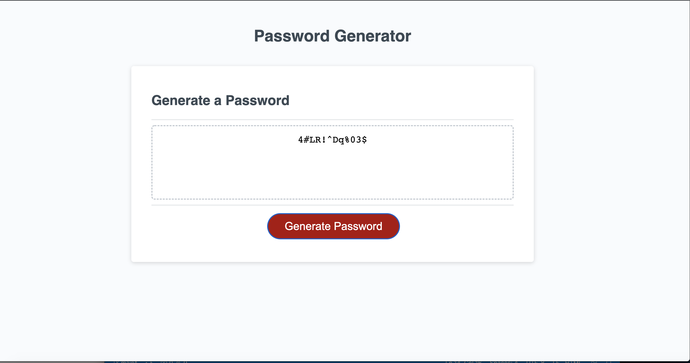

# pass-gen-repo

## Description

This project was challenging as it was my first time using javascript and had a mainly trouble wit the for loop  but I used my resources and figured it out . I was determined to figure out all the problems this project sure kept me on my toes.I built the project so the user can create a random password for any use they like. The problem this app solves is that it will generate a password for you that no one can ever guess. I learned many things from for loops to arrays and moreI enjoyed fixing my own problems as it showed me ehat mistakes as a developer I make .
## Usage

## Credits

The only credit that is due is to who ever created the HTML and CSS which i got from git Hub his git Hub link is listed down below.

https://github.com/coding-boot-camp/friendly-parakeet/commits?author=Xandromus
